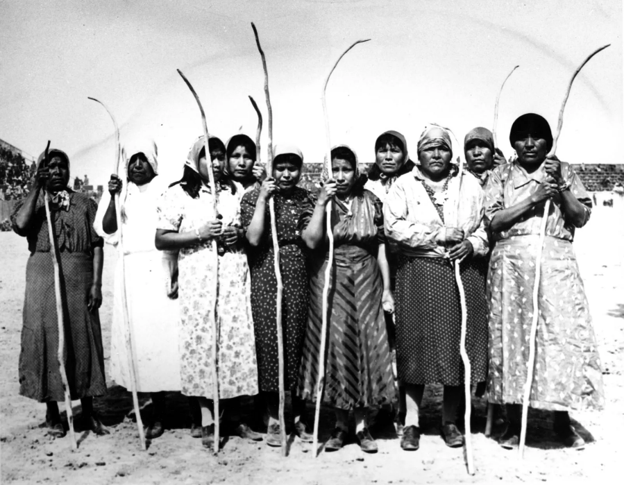
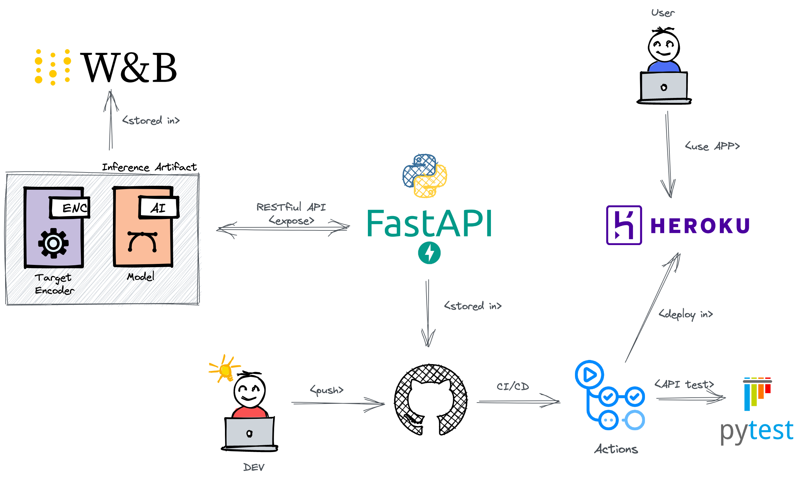

# MLOPS: PRIMA INDIANS DIABETES CLASSIFIER

UNIVERSIDADE FEDERAL DO RIO GRANDE DO NORTE

Programa de Pós Graduação em Engenharia Elétrica e de Computação (PPgEEC)

EEC1509 - APRENDIZAGEM DE MÁQUINA - T01 - 2022.1

Nome: Mateus Arnaud Goldbarg (20211027690)

Dataset: [Prima Indians Diabetes](https://www.kaggle.com/datasets/uciml/pima-indians-diabetes-database)

# Project Overview

In this project, we will apply the skills acquired in the [Machine Learning Fundamentals and Decision Trees](https://github.com/ivanovitchm/ppgeecmachinelearning/tree/main/lessons/week_02/sources) and [Deep Neural Networks fundamentals](https://github.com/ivanovitchm/ppgeecmachinelearning/tree/main/lessons/week_14) lesons, diven by [Ivanovich Silva](https://github.com/ivanovitchm), to deploy a classification model using [Prima Indians Diabetes](https://www.kaggle.com/datasets/uciml/pima-indians-diabetes-database) database. All steps of EDA, model training, model testing and others is found in [Machine Learning Fundamentals and Decision Trees for diabetes dataset](https://github.com/mateusArnaudGoldbarg/diabetes_decision_tree).

I deployed the model using the [FastAPI](https://fastapi.tiangolo.com/) package and create API tests. The API tests will be incorporated into a CI/CD framework using GitHub Actions. After this, I've build the API locally, test it and then deployed it to [Heroku](https://www.heroku.com/) and test it again once live. [Weights & Biases](https://wandb.ai/) was used to manage and tracking all artifacts created during ETL (Extract, Transform, Load), training and testing model.

## Prima Indians Diabetes Dataset

This dataset is originally from the National Institute of Diabetes and Digestive and Kidney Diseases. The objective of the dataset is to diagnostically predict whether or not a patient has diabetes based on certain diagnostic measurements (features) of females with at least 21 years old.

The datasets consists of the following features:

- Pregnancies: Number of pregnancies;
- Glucose: Plasma glucose concentration a 2 hours in an oral glucose tolerance test;
- BloodPressure: Diastolic blood pressure (mm Hg);
- SkinThickness: Triceps skin fold thickness (mm);
- Insulin: 2-Hour serum insulin (mu U/ml);
- BMI: Body mass index (weight in kg/(height in m)^2);
- DiabetesPedigreeFunction: Probability of the pacient have diabetes based on family historic;
- Age: Age (years);
- Outcome: Output class variable (0 or 1);

This is an unbalanced dataset, where 268 of 768 are 1 (diabetic), and 500 are 0 (healty).

## Workflow overview

All the workflow used to build the prediction model followed the good practices of ML workflow as described in the image bellow. The input data came from kaggle, as described before. It was made the Extract, transform and Load (ETL), including data preprocessing and EDA anda data clean. The data was splitted in training and test dataset, and then the traning dataset was divided again in traning and validation dataset for learning purpose. It was made some Hyperparameters tuning to reach the best accuracy as possible. Then, the model was saved as artifact and also used for testing.

## Deploy

All deploying process is described in the image bellow:

### Tools used for deployment

- [FastAPI](https://fastapi.tiangolo.com/)  as web framework;
- It was created and implemented a RESTful API using FastAPI with a Pydantic body with hints of each column, a GET method on the root giving a welcome message, a POST method to proceed to model inference and some unit tests of the API (Diabetic or Healthy);
- The trained model and the target encoder was stored in [Wandb](https://wandb.ai/);
- It was used [GitHub Actions](https://github.com/features/actions) to use the practices of Continuous Integration and Continuous Delivery (CI/CD);
- [Heroku](https://www.heroku.com/) was used to deployment and test it again once live and also for CD.

### Heroku's delivered API: https://prima-indians-app.herokuapp.com/docs

# Medium Article:

# References:
- https://github.com/ivanovitchm/colab2mlops;
- https://github.com/ivanovitchm/ppgeecmachinelearning;
- https://www.kaggle.com/datasets/uciml/pima-indians-diabetes-database;
- https://id.heroku.com/login;
- https://wandb.ai/site;
- https://fastapi.tiangolo.com/;
